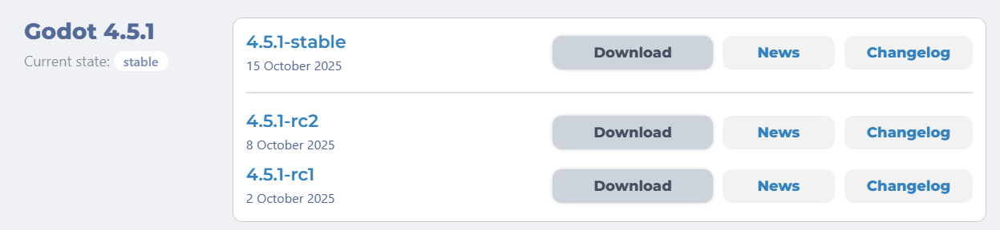
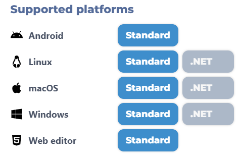
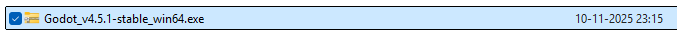
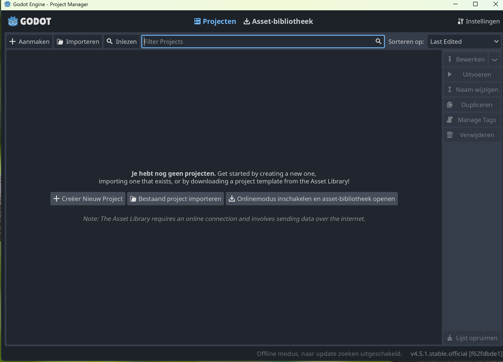

# Installatie

We gaan de Godot editor installeren op je computer.

## Stap 1: Downloaden editor

- Ga naar [deze link](https://godotengine.org/download/archive/)
- Zoek de eerste versie die begint met `4.5.` (op dit moment is dat 4.5.1-stable)

- Klik op `Download`
- Zoek naar `Windows` en klik dan op `Standard`

## Stap 2: Unzippen

In je `Downloads` folder, vind je nu een bestand dat hier op lijkt:

- Dubbelklik erop en kies bovenaan voor `Alles uitpakken`
- Verplaatst de twee bestanden naar een andere map op je computer waar je deze bestanden kan terugvinden.

## Stap 3: Openen editor
Dubbelklik op het bestand `Godot_v4.5.1-stable_win64` en als het goed is, opent Godot:

